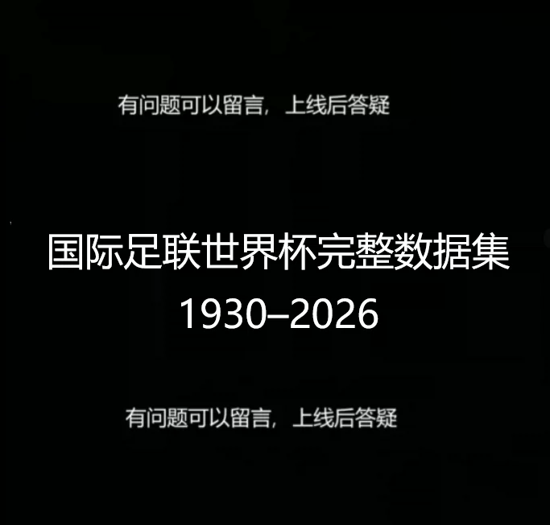
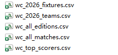
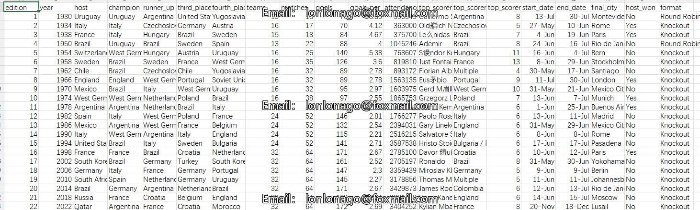
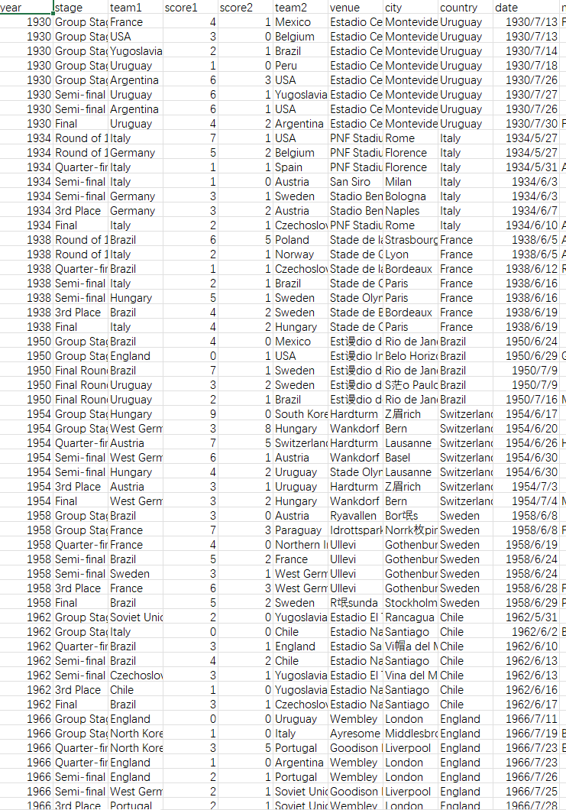

## Body

International Football Federation World Cup Complete Data Set: 1930–2026

Every match, every goal and moment of glory—from Uruguay in 1930 to the era of 48 teams in 2026.

International Football Federation World Cup Complete Data Set (1930–2026)
This is a comprehensive compilation of over a century of football history data from the first World Cup in Uruguay in 1930 to the upcoming 2026 World Cup jointly hosted by the United States, Canada, and Mexico.

wc_all_editions.csv — 21 editions of the host country, champion, runner-up, top scorer, total goals, audience, format, and final city for each World Cup.

wc_all_matches.csv — Complete match level data for 183 matches, including team names, scores, stages, venues, cities, countries, dates, and match notes.

wc_top_scorers.csv — 21 Golden Boot award winners, including player names, nationality, position, goals scored, assists, penalties, appearances, and final results of the teams.

wc_2026_fixtures.csv — Complete schedule for 103 matches in the 2026 World Cup, including group stage, stages, venues, kickoff times, FIFA rankings, federations and coaching staff.

wc_2026_teams.csv — 48 qualifying teams, grouped by federations, FIFA rankings, head coaches, best ever World Cup performance, and indicators for their debut in 2026.

Statistics fields can be seen in the product images

## Images

item_1056241359571

Here is a pay link on Stripe ( https://buy.stripe.com/3cs8yP7sY87d0vu9AB ). Please contact me lonlonago@foxmail.com after funding $89, and I will send you a complete data files , thank you!

